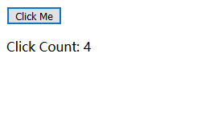

# lesson0：了解React
## React是什么？
React是Facebook的2013年推出的开源项目，是一个前端MVC框架，准确来说，React并不是一个完整的MVC框架，它更专注于VIEW（视图）层，需要配合社区中的一些库，如React-router、Redux等等才算是一个完整的MVC架构。  

## 初始化一个React项目
学任何一门语言和框架，往往是从hello world开始，不过只展示一句hello world就没有体现出React的优点，所以现在尝试写一个有交互Demo开始学习React。

### Example1[源码地址](./example)

这个Demo是一个计数器，每次点击按钮计数加1。  


  
  
如果像以前一样用`jQuery`进行开发的话，首先要设置一个变量，然后获取Button的DOM节点，每次点击将变量的值加1，然后替换页面上的Counter值。  

**jQuery实现**
``` javascript
let counter = 0,
    counterDom = $("#counter")

$("#button").click(function() {
  counter++;
  counterDom.html('Click Count: ' + counter);
})
```
通过`jQuery`实现一个计数器，首先要关注怎么去获取DOM节点，然后要关注怎么通过修改DOM节点的内容去更新视图。在每次更新视图层的时候，p标签里的内容全部更新，性能消耗比较大。

**React实现**
``` jsx
import React, { Component } from 'react'

class ClickCounter extends Component {
  constructor(props) {
    super(props);
    this.state = {
      count: 0
    }
    this.onClickButton = this.onClickButton.bind(this)
  }

  onClickButton() {
    this.setState({
      count: this.state.count + 1
    })
  }

  render() {
    const { count } = this.state

    return (
      <div>
        <button onClick={this.onClickButton}>Click Me</button>
        <p>Click Count: {count}</p>
      </div>
    )
  }
}

export default ClickCounter
```  

通过React实现一个计数器，不用关注如何获取DOM节点，如何更新DOM节点，而是专注于“界面应该显示成什么样子”，只用关注每次点击之后counter值应该变为多少，获取DOM更新DOM的过程React会帮我们完成。这样使用react进行开发的优势就体现出来了。

## React的优点
对react有了一个初步的认识，现在系统的总结一下使用React的优点。  

### 组件化 
> React的首要思想就是通过组件开发应用，组件就是指能完成某个特定的功能的独立的、可重用的代码。   
基于组件的开发模式，可以将一个大型应用拆分成许多小的组件，每个组件只关注特定范围内的特定功能，这个更方便进行管理，而且许多组件也可以进行复用。  

在上面的示例中，ClickCounter就是一个组件，他也可以在多个场景中被引用，React组件推荐使用ES6的写法，虽然React支持使用createClass函数来创建组件，但是现在官方逐渐废弃这个方法，使用ES6的写法也更加直观。

### 虚拟DOM  
在我们以前的Web开发中，需要频繁的获取DOM节点，然后对DOM进行操作，而DOM操作往往是页面性能的一个瓶颈。  
React因此引入了虚拟DOM机制。虚拟DOM是一个真实DOM的一个快速的、仅存在于内存的映射，它是抽象的。   

>虚拟DOM工作模式：  
1、先创建一个虚拟DOM树，它是真实DOM树的映射。  
2、只要数据模型发生变化，虚拟DOM就会将变化后的数据模型绘成新的虚拟DOM。  
3、然后对比两个虚拟DOM树之间的区别，找出在真实DOM树中需要修改的地方。  
4、最后在真实的DOM树中更新需要更新的部分。  

### 函数式编程
> 纯函数指的是相同的输入，永远得到相同的输出，而且没有任何可观察的副作用。   

每一个React组件都可以看成是一个纯函数，只用关心数据的映射，函数的值仅取决于函数参数的值，不依赖其他状态。  
React组件中render函数会返回一个DOM结构，将每个组件返回的DOM结构组装起来就可以组成一个大型应用。

### JSX
React中采用jsx语法，将Html代码直接写在Js中。JSX有一些基本的语法规则：  

#### 1、定义标签时，只允许被一个标签包裹
``` jsx
ReactDOM.render(
  <section>
    <h1>这是正确的例子</h1>
    <span>jsx</span>
  </section>,
  document.getElementById("example")
);

ReactDOM.render(
  <h1>这是错误的例子</h1>
  <span>jsx</span>,
  document.getElementById("example")
);
```

#### 2、标签一定要闭合  
``` jsx
 // 标签一定要闭合，img、br标签最后加上斜杠进行闭合
```

#### 3、class属性改为"className",for属性改为"htmlFor"
``` jsx
<div>
  <p className="text">class属性改为"className"</p>
  <label htmlFor="input"><input id="input" /></label>
</div>
```

#### 4、表达式使用{}包起来
``` jsx
<p className={isShow ? "text" : "text-hidden"}>表达式使用{}包起来</p>
```

#### 5、内联样式
``` jsx
const fontStyle = {
    fontSize: 18,
    color: '#000'
}
<p style={fontStyle}>内联样式</p>
```

#### 6、绑定事件
``` jsx
<button onClick={this.onClickButton}>Click Me</button>
```

#### 7、注释
``` jsx
{/* 节点注释 */}
/* 多行
   注释 */
```

#### 8、转义
``` jsx
var content='<strong>content</strong>';    
React.render(
    <div dangerouslySetInnerHTML={{__html: content}}></div>,
    document.body
);
```

## 总结 
第0节课：《了解React》。通过一个实例简单的介绍一下React，了解React的优点和以往的开发模式的区别。
